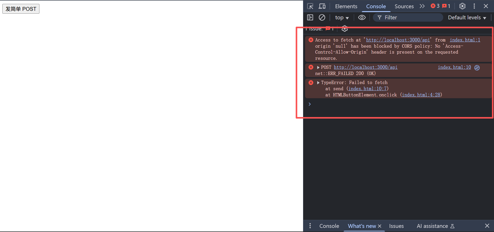
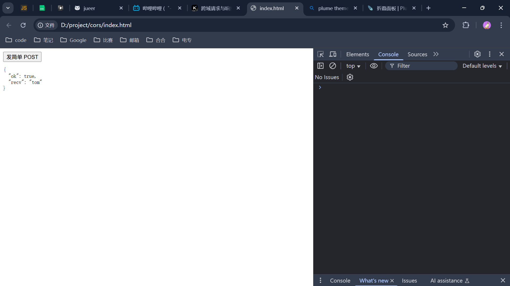
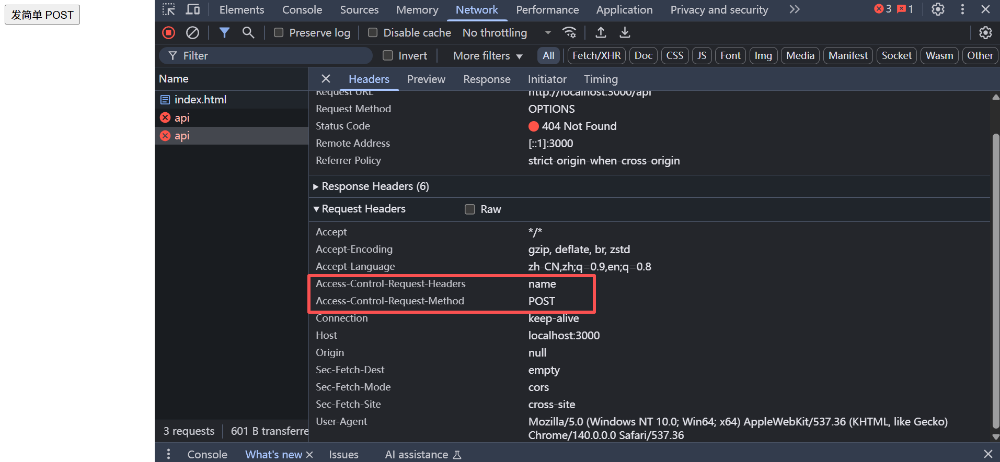

# １.跨域

## 跨域产生情况

对于一个url地址：`https://www.baidu.com/`，只要协议域名端口有一个不同就会产生跨域

| url1                                            | url2                                            | 是否跨域 | 原因                     |
| ----------------------------------------------- | ----------------------------------------------- | ---- | ---------------------- |
| <https://www.baidu.com/>                        | <https://www.baidu.com:8080/>                   | 是    | 端口不一样                  |
| <https://www.bilibili.com/>                     | <https://www.bilibili.com/>                     | 否    | 完全相同                   |
| <https://www.bilibili.com/>                     | <https://api.bilibili.com/>                     | 是    | 域名不一样                  |
| <https://www.bilibili.com/>                     | <https://www.bilibili.com/video/>               | 否    | 只是路径不同，协议、域名、端口都相同     |
| <https://www.bilibili.com/>                     | <http://www.bilibili.com/>                      | 是    | 协议不一样                  |
| <https://www.bilibili.com/>                     | <https://www.bilibili.com:8080/>                | 是    | 端口不一样                  |
| <https://www.bilibili.com/>                     | <https://www.bilibili.com:443/>                 | 否    | 端口相同，443 是 https 的默认端口 |
| <https://www.bilibili.com/>                     | <https://www.bilibili.com:80/>                  | 是    | 端口不一样，80 是 http 的默认端口  |
| <https://www.bilibili.com/>                     | <https://www.bilibili.com:8080/>                | 是    | 端口不一样                  |
| <https://www.bilibili.com/>                     | <https://www.bilibili.com:443/>                 | 否    | 端口相同，443 是 https 的默认端口 |
| [http://localhost:3000](http://localhost:3000/) | [http://127.0.0.1:3000](http://127.0.0.1:3000/) | 是    | 域名不同                   |

## 跨域解决办法-cors

> 跨域请求，是会发送到服务端，服务端也能正常响应的，只是当返回数据的时候，浏览器会发现进行了跨域请求，会进行拦截，不把数据拿给开发者。
> 所以要解决跨域的话就要告诉浏览器这部分数据允许跨域，可以把这部分数据拿给开发者

要解决跨域问题，需要先了解一下请求类型，简单请求和复杂请求

| 维度                | 简单请求（Simple Request）                                                                                                    | 复杂请求（Preflighted Request）                         |
| ----------------- | ----------------------------------------------------------------------------------------------------------------------- | ------------------------------------------------- |
| 触发条件              | 同时满足以下 3 类限制                                                                                                            | 只要打破左边任意一条                                        |
| 1. 方法             | 仅允许 GET、HEAD、POST                                                                                                       | 其它如 PUT、DELETE、PATCH、自定义方法…                       |
| 2. 常见头字段          | 仅允许以下 9 个字段（大小写不敏感）<br>Accept、Accept-Language、Content-Language、Content-Type、DPR、Downlink、Save-Data、Viewport-Width、Width | 带任何其它字段（如 Authorization、X-Token、X-Requested-With） |
| 3. Content-Type 值 | 仅允许 3 种<br>• application/x-www-form-urlencoded<br>• multipart/form-data<br>• text/plain                                 | 其它如 application/json、application/xml、text/xml…    |
| 是否先发送 OPTIONS     | ❌                                                                                                                       | ✅ 需服务器返回 200 且含 Access-Control-Allow-\* 系列头       |

### 简单请求
对于简单请求得跨域，只需要在服务端中的添加响应头：`Access-Control-Allow-Origin: ` 在这里添加对应运行跨域请求的源，例如：`Access-Control-Allow-Origin: https://example.com`


::: collapse
- 服务端

  ```js
  // server.js
  const http = require('http');
  const querystring = require('querystring');

  http.createServer((req, res) => {
  // ① 允许跨域 如果不添加的话就会产生跨域，前端请求数据的话会报错
  //   res.setHeader('Access-Control-Allow-Origin', '*');
  //   res.setHeader('Content-Type', 'application/json;charset=utf-8');

    if (req.method === 'POST' && req.url === '/api') {
      let body = '';
      req.on('data', chunk => body += chunk);
      req.on('end', () => {
        const parsed = querystring.parse(body);   // name=tom
        res.end(JSON.stringify({ ok: true, recv: parsed.name }));
      });
    } else {
      res.statusCode = 404;
      res.end(JSON.stringify({ ok: false }));
    }
  }).listen(3000, () => console.log('CORS server on http://localhost:3000'));
  ```

- 前端

  ```html
  <!doctype html>
  <html>
  <body>
    <button onclick="send()">发简单 POST</button>
    <pre id="result"></pre>

    <script>
      function send() {
        // 简单请求：方法=POST，Content-Type=表单格式
        fetch('http://localhost:3000/api', {
          method: 'POST',
          headers: { 'Content-Type': 'application/x-www-form-urlencoded' },
          body: 'name=tom'
        })
        .then(r => r.json())
        .then(data => document.getElementById('result').textContent = JSON.stringify(data, null, 2))
        .catch(console.error);
      }
    </script>
  </body>
  </html>
  ```

:::


```
// ① 允许跨域 如果不添加的话就会产生跨域，前端请求数据的话会报错
//   res.setHeader('Access-Control-Allow-Origin', '*');
//   res.setHeader('Content-Type', 'application/json;charset=utf-8');
```
上面服务端代码中这部分注释的内容即为允许跨域的内容，* 代表运行所有请求跨域 ，如果不添加的话就会报如下的错误，表示出现了跨域问题
::: collapse
- 出现跨域问题

	
- 正常请求

	
:::
### 复杂请求
当请求是复杂请求的时候会触发预检，即`option`请求，option请求中会携带当前请求的请求方法，自定义请求头，content-type，向服务端发送请求,如果预检通过就返回200，再进行正常的请求
例如我添加了一个自定义请求头：`name:'jueer'`
```js
      fetch('http://localhost:3000/api', {
        method: 'POST',
        headers: { 'Content-Type': 'application/x-www-form-urlencoded' ,name:'jueer'},
        body: 'name=tom'
      })
```
请求的时候对应的option请求：`access-control-request-headers` `access-control-request-method`

那么对应的复杂请求，需要在预检的时候配置预检option的请求，以及对应的允许跨域的内容
```js
      'Access-Control-Allow-Origin': '*',
      'Access-Control-Allow-Methods': 'POST, OPTIONS',
      'Access-Control-Allow-Headers': 'Content-Type, name' 
```
::: collapse
- 完整代码

	```js
	const http = require('http');
	const querystring = require('querystring');
	
	http.createServer((req, res) => {
	  // === 预检阶段 ===
	  if (req.method === 'OPTIONS') {
	    res.writeHead(200, {
	      'Access-Control-Allow-Origin': '*',
	      'Access-Control-Allow-Methods': 'POST, OPTIONS',
	      'Access-Control-Allow-Headers': 'Content-Type, name'   // 放行自定义头
	    });
	    res.end();
	    return;
	  }
	
	  // === 正式业务 ===
	  res.setHeader('Access-Control-Allow-Origin', '*');
	  res.setHeader('Content-Type', 'application/json;charset=utf-8');
	
	  if (req.method === 'POST' && req.url === '/api') {
	    let body = '';
	    req.on('data', c => body += c);
	    req.on('end', () => {
	      const parsed = querystring.parse(body);
	      res.end(JSON.stringify({ ok: true, recv: parsed.name }));
	    });
	  } else {
	    res.statusCode = 404;
	    res.end(JSON.stringify({ ok: false }));
	  }
	}).listen(3000, () => console.log('CORS server on 3000'));
	```
:::

### cors库
如果每次请求都要自己去加一个option请求的话，比较麻烦，有现有的cors库，会自动拦截 OPTIONS 并返回所需预检头，业务代码专注逻辑即可。
```js
// server.js
const http    = require('http');
const cors    = require('cors')({ origin: '*', allowedHeaders: ['Content-Type', 'name'] });
const qs      = require('querystring');

const server = http.createServer((req, res) => {
  cors(req, res, () => {          // ← 自动处理 OPTIONS 与响应头
    if (req.method === 'POST' && req.url === '/api') {
      let body = '';
      req.on('data', c => body += c);
      req.on('end', () => {
        res.writeHead(200, { 'Content-Type': 'application/json' });
        res.end(JSON.stringify({ ok: true, recv: qs.parse(body).name }));
      });
    } else {
      res.writeHead(404).end(JSON.stringify({ ok: false }));
    }
  });
});

server.listen(3000, () => console.log('CORS server on 3000'));
```

## 跨域解决办法-jsonp
直接使用html标签也可以实现跨域，如img，script标签都可以实现跨域，但是只能使用get方法
