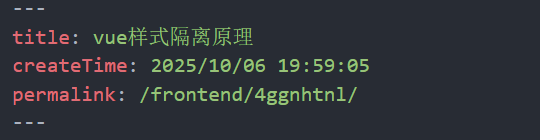

# 7.vuepress plume主题

之前尝试用了一下theme hope主题，但是它不能设置文章目录，我有点看不惯那个此页内容的目录方式，就改用plume主题

配置的话比使用默认主题自己配置方便很多，直接`pnpm create vuepress-theme-plume@latest` 根据指导安装就好

需要配置的内容只有git pages的配置，和默认的一样，需要token 和分支的设置
其他直接根据自己需要使用官方文档参考配置就好-->[plume theme](https://theme-plume.vuejs.press/guide/intro/)

---
## 侧边导航栏配置
> .vuepress/notes.ts

我配置的时候主要是侧边导航栏没有搞明白

它有默认的博客类型文章，可以自动进行分类，tag，归档等的统计：[博客页面](https://theme-plume.vuejs.press/guide/blog/#%E9%A2%84%E8%AE%BE%E9%85%8D%E7%BD%AE)

而侧边导航栏的文章需要全部放在notes文件夹下（也可以自己指定），这里面的文章就不会再显示在博客类型文章的统计中了➡[原文指路](https://theme-plume.vuejs.press/guide/project-structure/#%E5%85%B6%E5%AE%83%E7%9B%AE%E5%BD%95-%E6%96%87%E4%BB%B6)

我有强迫症，就想既要在博客中进行归纳，又要在侧边导航栏进行展示。

最后只配置了notes类型文章，舍弃了博客类文章，将所有文章都放在了notes文件夹下，侧边导航栏的结构是多级可展开的结构
```ts
import { defineNoteConfig, defineNotesConfig } from 'vuepress-theme-plume'

const frontendNote = defineNoteConfig({
  dir: '前端相关',
  link: '/frontend/',
  sidebar: [
    {
      text: '前端相关',
      collapsed: true, // 前端相关标题可折叠
      items: 'auto'
    },
  ],
})

export default defineNotesConfig({
  dir: 'notes',
  link: '/',
  notes: [frontendNote],
})
```

侧边导航栏配置➡[详细配置信息](https://theme-plume.vuejs.press/guide/document/)：`notes.ts`进行如上配置，其中：
* link：
	* 指的是每个markdown文件的yaml的`permalink`属性的公共前缀，文件夹下所有的文章的这部分需要相同（比如我的改文件夹下所有的`permalink`的前缀都为`frontend`），
	* 这部分属性内容在构建的时候会自动生成，所以可以先把文件放在对应文件夹下，然后再`pnpm run docs:dev`,自动生成属性信息。
	* 只用在一级部分设置link，即我的前端相关部分，子级下面设置的不起作用
	* 如果新起一级目录，也是同样的方式，重新设置不同的link就可以
* dir：
	* 这个是路径，可以为相对路径，采用[prefix](https://theme-plume.vuejs.press/guide/document/#%E5%85%B3%E4%BA%8E-prefix)进行公共链接的提取




> [!NOTE] tip
> 此外我每个文件夹下都加了一个index.md文件，用于表示该文件夹下的目录，这个部分使用[card](https://theme-plume.vuejs.press/guide/markdown/card/)方式进行编写目录，在侧边导航栏中直接点击父文件夹可以自动跳转到对应的目录下

## 顶部导航栏配置

> .vuepress/navbar.ts

```ts
/**
 * @see https://theme-plume.vuejs.press/config/navigation/ 查看文档了解配置详情
 *
 * Navbar 配置文件，它在 `.vuepress/plume.config.ts` 中被导入。
 */

import { defineNavbarConfig } from 'vuepress-theme-plume'

export default defineNavbarConfig([
  { text: '首页', link: '/' },
  // { text: '博客', link: '/blog/' },
  // { text: '标签', link: '/blog/tags/' },
  // { text: '归档', link: '/blog/archives/' },
  // { text: '分类', link: '/blog/categories/' },
  {
    text: '前端相关',
    items: [
      {
        text: '目录', link: '/notes/前端相关/index.md',
      },
      {
        text: 'vue', link: '/notes/前端相关/vue/index.md'
      },
      {
        text: 'js', link: '/notes/前端相关/js/index.md'
      }
    ]
  }
])

```

在这里我对顶部导航栏只做对应每种类别的导航，没有写具体文章了(一是在notes侧边导航栏中写了，二是这部分需要手写而侧边导航栏可以直接使用`auto`关键字自动生成)

## 后续添加文章
1. 直接将md文件和图片添加到对应文件夹，不需要修改其他任何东西
2. 如果新建了一级标题就再新增侧边导航栏和顶部导航配置