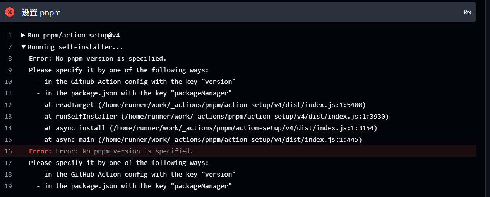

# vue press构建

  

## 项目初始化

```bash

# 创建并进入一个新目录

mkdir vuepress-starter

cd vuepress-starter

  

# 初始化项目

git init

pnpm init

# 安装 vuepress
# 安装 vuepress 和 vue
pnpm add -D vuepress@next vue
# 安装打包工具和主题
pnpm add -D @vuepress/bundler-vite@next @vuepress/theme-default@next

# 创建 `docs` 目录和 `docs/.vuepress` 目录

mkdir docs

mkdir docs/.vuepress

```

创建 VuePress 配置文件 `docs/.vuepress/config.js`

```js

import { viteBundler } from '@vuepress/bundler-vite'

import { defaultTheme } from '@vuepress/theme-default'

import { defineUserConfig } from 'vuepress'

  

export default defineUserConfig({

  bundler: viteBundler(),

  theme: defaultTheme(),

})

```

在 `package.json` 中添加部分script ：

```json

{

  "scripts": {

    "docs:dev": "vuepress dev docs",

    "docs:build": "vuepress build docs"

  }

}

```

```bash

# 运行 `docs:dev` 脚本可以启动开发服务器:

pnpm run docs:dev

# 运行 `docs:build` 脚本可以构建你的网站：

pnpm run docs:build

# 打包好的文件会放在docs/.vuepress/dist中，在这里可以对静态文件进行部署

```

  

以上部分和官网一样，[vue press 官网](https://vuepress.vuejs.org/zh/guide/getting-started.html#%E5%88%9B%E5%BB%BA%E9%A1%B9%E7%9B%AE)

我在运行的时候还需要下载一个插件：

```bash

pnpm install -D sass-embedded

```

  

创建好后目录结构如下：

  


  

所有的笔记保存在docs文件夹下

我的大部分布局是这样的：

  


  

前端相关和js作为一级分类的文件夹，里面再有分类就用文件夹，然后attachments存放图片和pdf等附件

  

启动项目后就可以在浏览器中看到对应的文档，不过要导航到对应的路由，

> 例如我的`6.vue press构建`在文档中相对docs的路径为`\1.前端相关\1.vue\6.vue press构建.md`

> 那么路由地址即为：`1.前端相关/1.vue/6.vue press构建.html`

  

## 主页配置

默认配置下，docs根路径下 `README.md` 和 `index.md` 都会被转换成 `index.html` ，并且其对应的路由路径都是由斜杠结尾的，README或者index作为主页。

可以使用yaml语法进行markdown文档的属性标记，参考的可以配置的属性：[属性参考](https://vuepress.vuejs.org/zh/reference/frontmatter.html)


```yaml

---
home: true
heroImage: /assets/image-1.jpg
heroText: jueer's bolg
tagline: 前端学习，vue原理解析，报错整理……
---

```

  
对于导航栏等的基础配置，在config中实现，参考官方文档：[默认主题导航栏配置](https://vuepress.vuejs.org/zh/guide/theme.html#%E9%BB%98%E8%AE%A4%E4%B8%BB%E9%A2%98)
  

下面是我得配置

```js

import { viteBundler } from '@vuepress/bundler-vite'
import { defaultTheme } from '@vuepress/theme-default'
import { defineUserConfig } from 'vuepress'

export default defineUserConfig({
    bundler: viteBundler(),
    theme: defaultTheme({
        navbar: [
            {
                text: "home",
                link: "/"
            },
            {
                text: "前端相关",
                prefix: "/前端相关/",
                children: [{
                    text: 'vue',
                    prefix: 'vue/',
                    children: ['vue2响应式原理.md',
                        'vue3响应式原理.md',
                        'vue的diff算法.md',
                        'vue样式隔离原理.md',
                        'keep-alive原理.md',
                        'vue press构建.md'
                    ]
                },
                {
                    text: "js",
                    prefix: "/2.js/",
                    children: []
                }]
            },
        ]
    }),
})
```

效果如下：


## git page部署

[官方配置信息](https://vuepress.vuejs.org/zh/guide/deployment.html#github-pages)
在此基础上需要修改：
**1、安装sass-embedded**
```bash
pnpm add -D sass-embedded
```
**2、设置自动化进程中的pnpm的版本**



将docs.yml中pnpm部分修改成如下部分
```
      - name: 设置 pnpm
        uses: pnpm/action-setup@v4
        with:
          version: 9
          run_install: false
```

**3. 加上github pages的token**：
在 GitHub 账号设置中创建一个 **Personal Access Token (PAT)**：
> GitHub 右上角头像 → Settings → Developer settings → Personal access tokens → Tokens (classic) → Generate new token  
   勾选 `repo` 与 `workflow` → Generate → 复制令牌串。

将此令牌添加到仓库的 `Secrets` 中，命名为 `GITHUB_TOKEN` 或类似名称
>进入目标仓库 → Settings → Secrets and variables → Actions → New repository secret  
   Name 填 `GITHUB_TOKEN`  
   Value 粘贴刚才的令牌 → Add secret。
```bash
GITHUB_TOKEN: ${{ secrets.GITHUB_TOKEN }}
# 在自动化脚本中修改对应的secret设置的名字
```
授权：
- 进入你的仓库的 **Settings** 页面。
- 选择 **Actions**。
- 在 **Workflow permissions** 下，确保选择了 **Read and write permissions**，以便 GitHub Actions 可以对仓库进行推送。